- [Part 1. Инструмент ipcalc](#part-1-инструмент-ipcalc)
- [Part 2. Статическая маршрутизация между двумя машинами](#part-2-статическая-маршрутизация-между-двумя-машинами)
- [Part 3. Утилита iperf3](#part-3-утилита-iperf3)
- [Part 4. Сетевой экран](#part-4-сетевой-экран)
- [Part 5. Статическая маршрутизация сети](#part-5-статическая-маршрутизация-сети)
- [Part 6. Динамическая настройка IP с помощью DHCP](#part-6-динамическая-настройка-ip-с-помощью-dhcp)
- [Part 7. NAT](#part-7-nat)
- [Part 8. Дополнительно. Знакомство с SSH Tunnels](#part-8-дополнительно-знакомство-с-ssh-tunnels)

## Part 1. Инструмент ipcalc

- Устанавливаем ipcalc `sudo apt install ipcalc`

### 1.1. Сети и маски
- 1) Определяем адрес сети `ipcalc 192.167.38.54/13`\
	Это будет адрес в графе network -- 192.160.0.0

	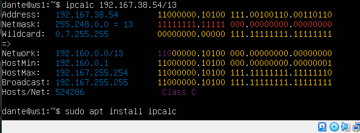
	
- 2) 
	- Маска 255.255.255.0\
	в префиксной = /24 \
	в двоичной = 11111111.11111111.11111111.00000000
	
	- Маска /15 \
	в обычной = 255.254.0.0 \
	в двоичной = 11111111.11111110.00000000.00000000
	
	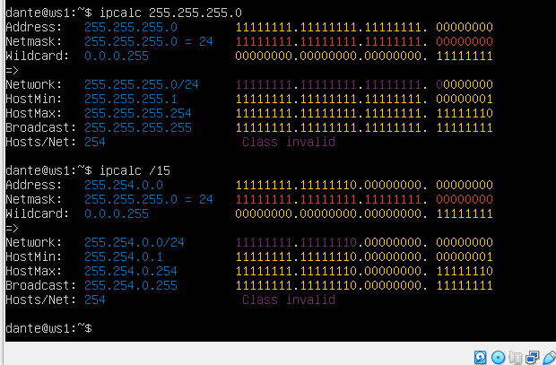
	
	- Маска 11111111.11111111.11111111.11110000: \
	в обычной = 255.255.255.240\
	в префиксной = /28
	
- 3) Например маска /8 (255.0.0.0) означает, что только первый октет относится
	к адресу сети, а остальные три октета — к адресам хостов.\
	Диапазоны адресов хостов для сети `12.167.38.4` при масках:
	- `/8`: 12.0.0.1 -- 12.255.255.254
	- `11111111.11111111.00000000.00000000`: 12.167.0.1 -- 12.167.255.254
	
	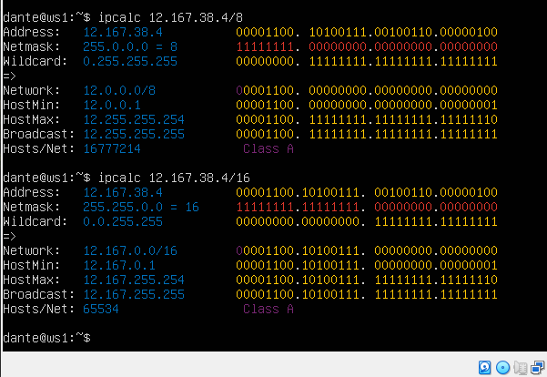
	
	- `255.255.254.0`: 12.167.38.1 -- 12.167.39.254
	- `/4`: 0.0.0.1 -- 15.255.255.254
	
	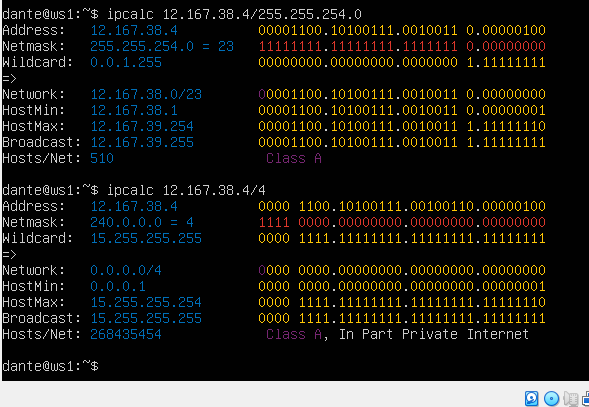
	
### 1.2. localhost

- 	Приложения на localhost — это приложения на локальном компьютере.\
	Весь диапазон 127.0.0.0/8 (127.x.x.x) зарезервирован для локальной
	обратной связи (loopback) и не используется для обмена между узлами сети.\
	\
	Соответственно:\
	194.34.23.100 -- нет\
	127.0.0.2 -- да\
	127.1.0.1 -- да\
	128.0.0.1 -- нет\
	Можно пропинговать и увидеть что для локальных адресов нет потерь пакетов:
	
	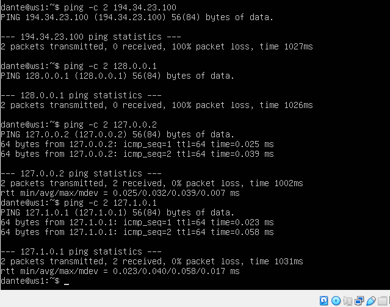
	
### 1.3. Диапазоны и сегменты сетей
- 1) Под частные (локальные сети) сети зарезервированы следующие диапазоны адресов:\
	10.0.0.0 — 10.255.255.255 (10.0.0.0/8);\
	172.16.0.0 — 172.31.255.255 (172.16.0.0/12);\
	192.168.0.0 — 192.168.255.255 (192.168.0.0/16)\
	
	Для частных:\
	10.0.0.45, 192.168.4.2,	172.20.250.4, 172.16.255.255, 10.10.10.10\
	Проверяем `ipcalc`, у частных в графе `Hosts/net` прописано `Privet Internet`
	
	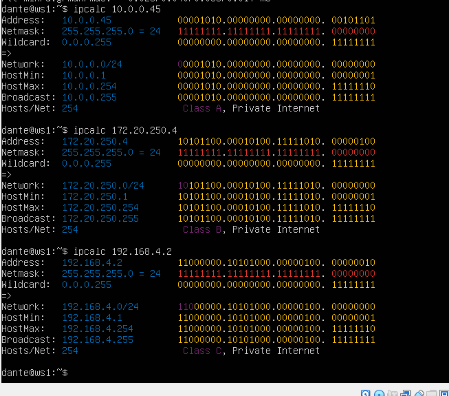
	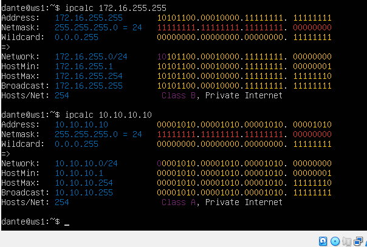
	
	Для публичных: \
	134.43.0.2,	172.0.2.1, 172.68.0.2, 192.172.0.1, 192.169.168.1
	
	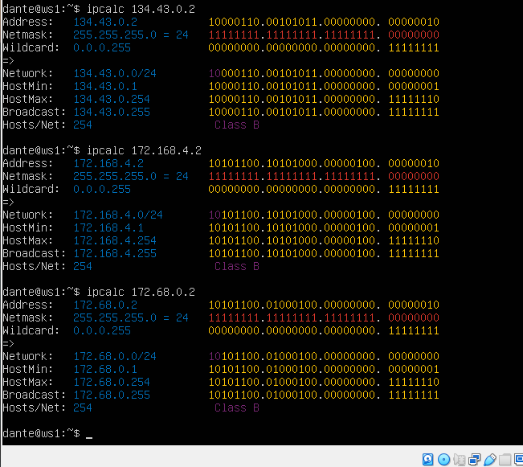
	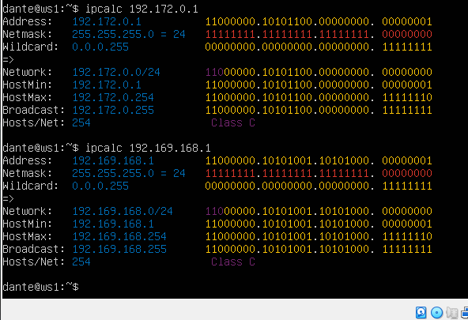
	
- 2) Диапазон возможных IP-адресов для сети 10.10.0.0/18: 10.10.0.1 - 10.10.63.254\
	Таким образом, возможные: 10.10.0.2, 10.10.10.10
	
	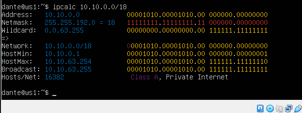

## Part 2. Статическая маршрутизация между двумя машинами
	
- Существующие сетевые интерфейсы: `ip a`

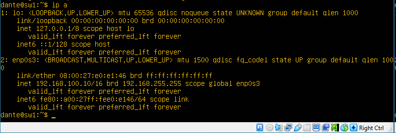

- Настраиваем интерфейс для работы на внутренней сети:
	
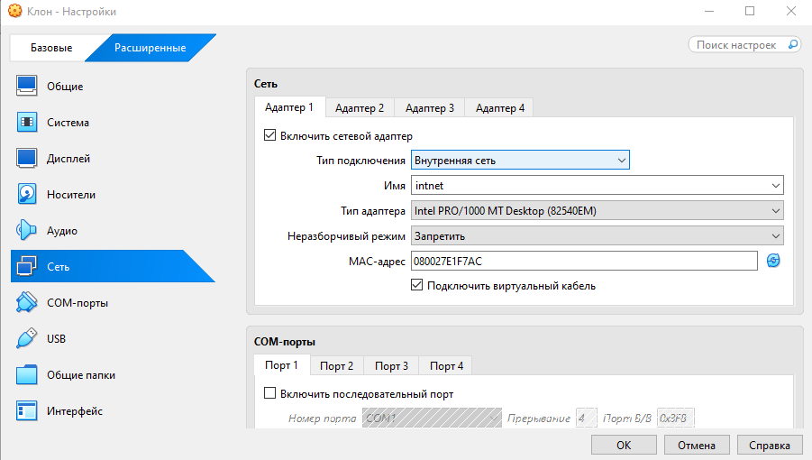

- Задаем новые настройки для работы на внутренней сети: \
	`sudo vim /etc/netplan/00-installer-config.yaml` \
	И применяем: `netplan apply`
	
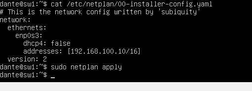
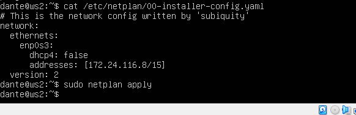

### 2.1. Добавление статического маршрута вручную
- Добавление статического маршрута вручную\
	`sudo ip r add 172.24.116.8 dev enp0s3` \
	`sudo ip r add 192.168.100.10 dev enp0s3`

- Пропингуем для теста по 3 пакета:\
	`ping 172.24.116.8 -c 3`\
	`ping 192.168.100.10 -c 3`
	
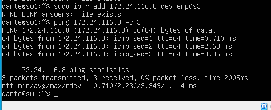
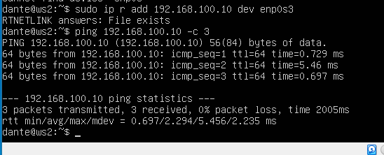

### 2.2. Добавление статического маршрута с сохранением
- Настраиваем 2 адаптера для каждой машины: для доступа в интернет(NAT), и создания внутренней сети
 
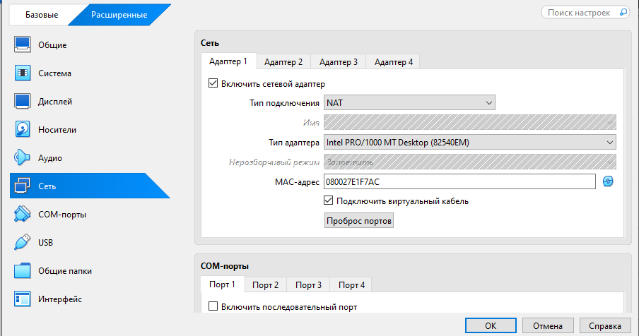
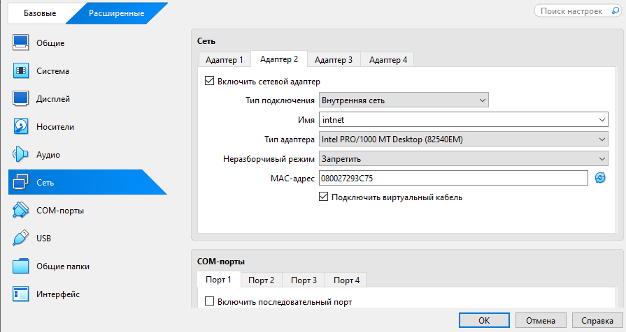

- Добавляем записи маршрутов в файл сетевого интерфейса (netplan) с помощью свойства routes.
- Пингуем для теста 3 пакета

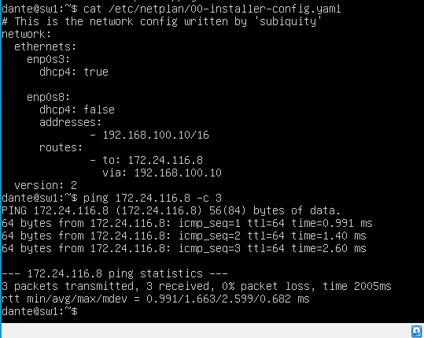
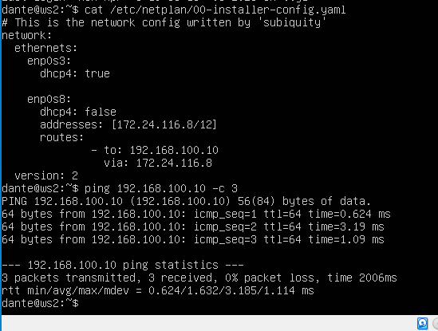

## Part 3. Утилита iperf3
- `sudo apt install iperf3` - установка

- 8 Mbps(мегабиты в сек.) = 1 MB/s (мегабайты в сек.)
- 100 MB/s (мегабайты в сек) = 800000 в Kbps (килобит в сек.)
- 1 Gbps (гигабиты в сек.) =  1000 Mbps (мегабиты в сек.)

-  Запускаем iperf3, одну машину в режиме сервера `perf3 -s -f M`. В конце ставим `M` для отображения в мегабайтах.

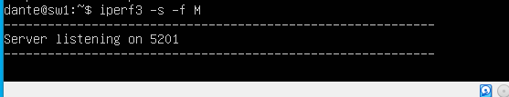

- Вторую локальную машину запустим в режиме клиента с помощью флага -c и укажем хост сервера (используем его IP-адрес, либо домен, либо имя хоста):
	`iperf3 -c 192.168.10.1 -f M`
	
- получаем результат на обоих машинах

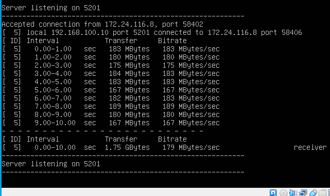
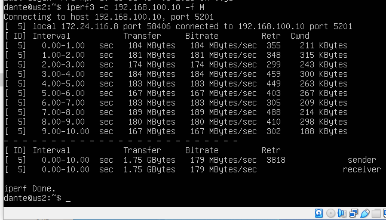

## Part 4. Сетевой экран

### 4.1. Утилита iptables
- iptables — использует цепочки политики(policy) для разрешения или блокирования трафика.

- Перечень основных действий Iptables: \
	-F – очистить все правила \
	-X – удалить цепочку \
	-A – добавить правило в цепочку \
	-P – установить действие по умолчанию \
	-C – проверить применяемые правила \
	-D – удалить текущее правило \
	-I – вставить правило с указанным номером \
	-L – вывести правила текущей цепочки \
	-S – вывести все активные правила \
	-N – создать цепочку 

- Дополнительные опции: \
	-p – вручную установить протокол (TCP, UDP, UDPLITE, ICMP, ICMPv6, ESP, AH, SCTP, MH) \
	-s – указать статичный IP-адрес оборудования, откуда отправляется пакет данных \
	-d – установить IP получателя \
	-i – настроить входной сетевой интерфейс \
	-o – настроить выходной сетевой интерфейс \
	-icmp-type - (Internet Control Message Protocol) — это протокол служебных сообщений в IP-сетях  \
	-j – выбрать действие при подтверждении правила 

- Создаем файл /etc/firewall.sh	и вносим правила

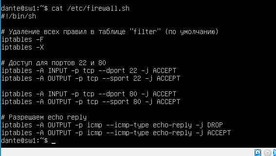
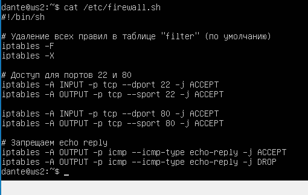

- Запускаем

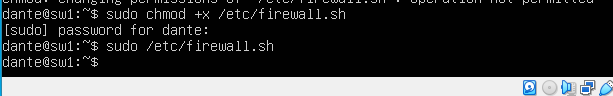
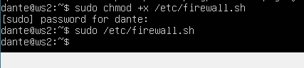

- iptables читает правила сверху вниз. Если пакет подошёл под правило с действием (ACCEPT или DROP) — он сразу выполнит его, и следующие правила игнорируются.
	Для машины ws1 пакет наталкивается на первое же правило DROP и отбрасывается. Ко второму правилу (ACCEPT) выполнение не доходит. 	
	Для машины ws2 напротив, первым стоит ACCEPT - разрешить прохождение пакета. Пинг проходит.

### 4.2. Утилита nmap
- Установка `sudo apt install nmap`

- Пингуем ws1:
	
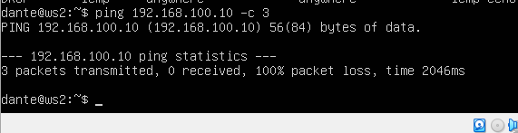

- Пингуем ws2:
	
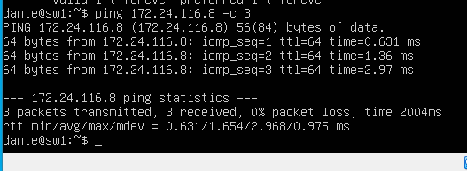

- ws1 не пингуется. Проверяем nmap, видим, что хост машины запущен ("Host is up"):

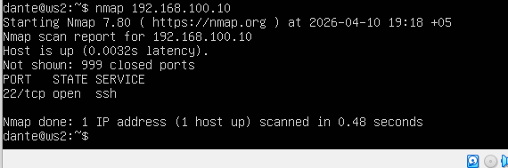

- Создаем резервные копии:

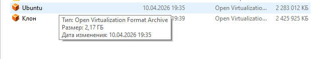

## Part 5. Статическая маршрутизация сети

### 5.1. Настройка адресов машин
- Настраиваем IP адреса

	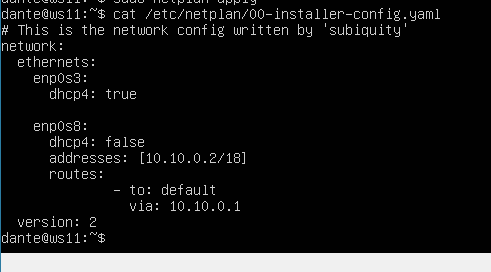
	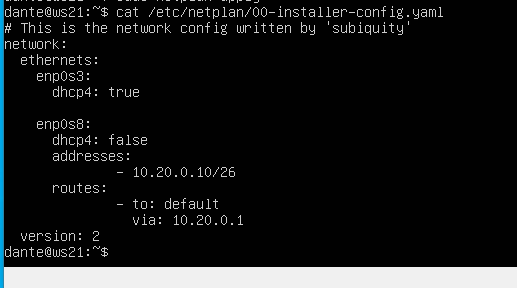
	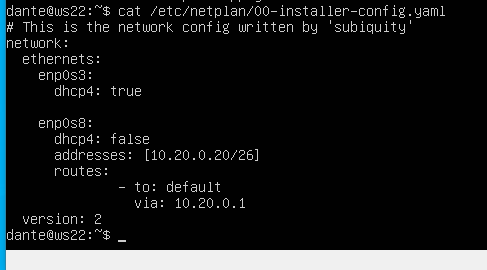
	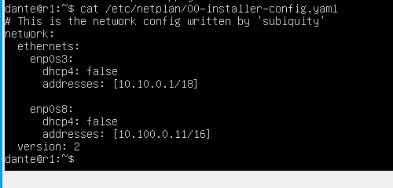
	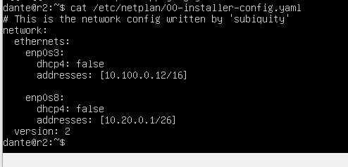
	
- После изменения настроек применяем их на каждой машине `sudo netplan apply`. Команда ничего не выведет.

- Проверяем `ip -4 a`, видим что ip установились

	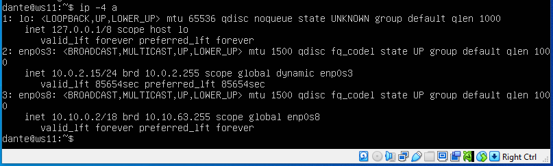
	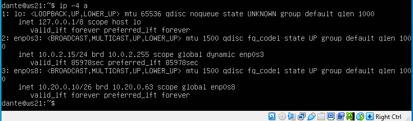
	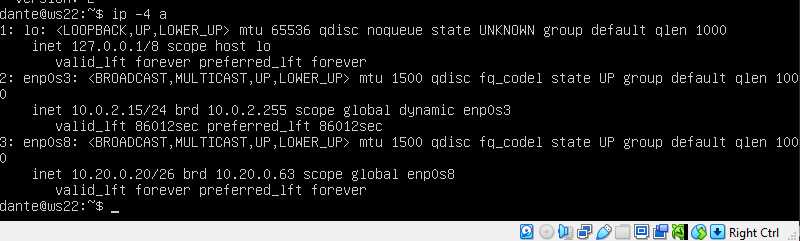
	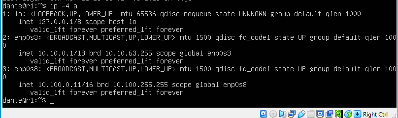
	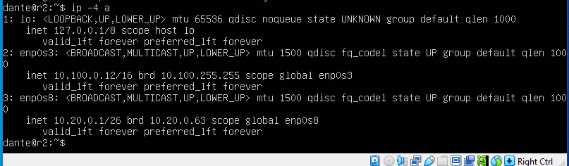

- `sudo systemctl restart systemd-networkd` - для перезапуска сервиса сети
- Пингуем ws22 и r1

	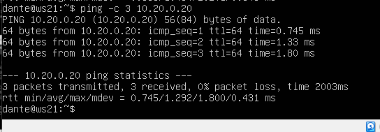
	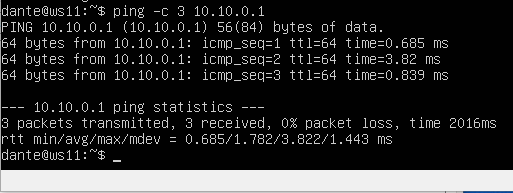

### 5.2. Включение переадресации IP-адресов
- `sudo sysctl -w net.ipv4.ip_forward=1`\
	Флаг "-w" означает "запись" (write). Значение "1" передается в параметр "net.ipv4.ip_forward", чтобы включить переадресацию IP-пакетов.
	
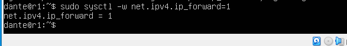

	"net.ipv4.ip_forward" - параметр в системе Linux, который регулирует переадресацию IP-пакетов между сетевыми интерфейсами.
	Если значение этого параметра равно "1", то переадресация IP-пакетов включена, и Linux будет пересылать пакеты между различными сетевыми интерфейсами,
	что позволяет устройствам в разных сетях коммуницировать друг с другом.

- Изменяем конфигурацию sysctl, убираем(раскоментируем) `#` для net.ipv4.ip_forward=1

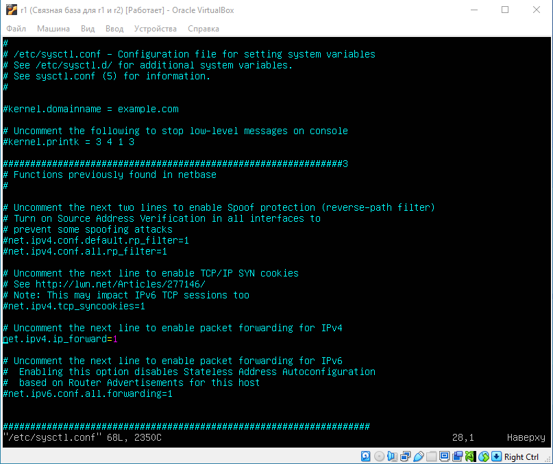
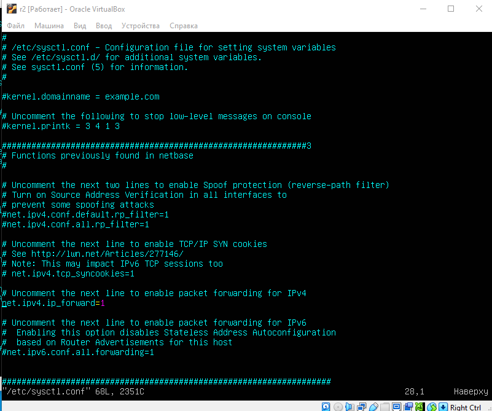

### 5.3. Установка маршрута по умолчанию
- Маршруты по умолчанию

- Вывод `ip r`

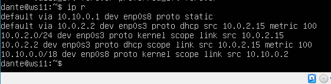
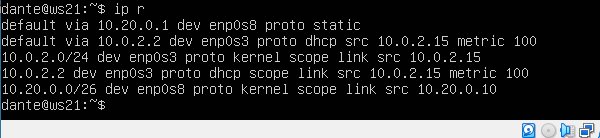
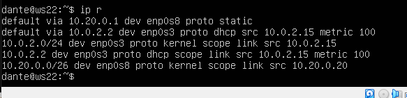

- Вводим `sudo tcpdump -tn -i enp0s3` на r1 и пингуем с ws11\
	tcpdump - позволяет прослушать порты и вывести на экран информацию с каких IP адресов приходят пакеты.\
	"-n" указывает о необходимости выводить только числовые IP-адреса вместо имён хостов.\
	"-t" отключает вывод временных меток.\
	"-i enp0s3" - опция для указания tcpdump о необходимости прослушивать сетевой интерфейс с именем "enp0s3".

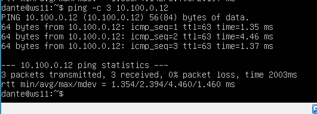

### 5.4. Добавление статических маршрутов
- Прописываем статические маршруты до сетей в netplan

- Вывод `ip r`, "proto static" в выводе, означает, что маршрут был добавлен статически вручную, "kernel" ядром системы.

- Вывод `ip r list 10.10.0.0/18` на ws11

- Вывод `ip r list 0.0.0.0/0`

- При выборе маршрута из таблицы маршрутизации будет выбран наиболее точный.
	Ключевым правилом выбора в Linux (и большинства других систем) является Longest Prefix Match — выбор маршрута с самой длинной сетевой маской.
	Приоритет всегда отдается маршруту с наибольшим префиксом, даже если другой, менее специфичный маршрут (как default) тоже технически подходит под адрес назначения.
	
### 5.5. Построение списка маршрутизаторов

- Команда `tcpdump -tnv -i enp0s3` выполняет захват и анализ сетевого трафика с указанными параметрами:\
	`-t` (без времени) отключает вывод временных меток в каждой строке \
	`-n` (не переводить имена) отключает преобразование IP-адресов в доменные имена, не выполняет DNS-запросы для определения имен хостов\
	`-v` (verbose - подробный режим) показывает дополнительную информацию о пакетах: TTL (Time To Live), ID пакета, Тип и код ICMP, Опции IP
	

- Вывод `traceroute 10.20.0.10`
	

- Traceroute - показывает маршрутизаторы на пути к цели. Позволяет построить полную карту сетевого пути, даже не имея предварительной информации о топологии сети.

	Для определения промежуточных маршрутизаторов traceroute отправляет серию из трёх пакетов данных целевому узлу, при этом каждый раз увеличивая на 1 значение поля TTL («время жизни»).
	Это поле обычно указывает максимальное количество маршрутизаторов, которое может быть пройдено пакетом.	Первый пакет отправляется с TTL = 1, первый же маршрутизатор
	возвращает обратно сообщение ICMP (Internet Control Message Protocol), указывающее на невозможность доставки данных до целевого адреса. Traceroute фиксирует адрес маршрутизатора,
	а также время между отправкой пакета и получением ответа (эти сведения выводятся на монитор компьютера). Затем traceroute повторяет отправку пакета,
	но уже с TTL, равным 2, что позволяет первому маршрутизатору пропустить пакет дальше. Процесс повторяется до тех пор, пока при определённом значении TTL пакет
	не достигнет целевого узла.	При получении ответа от этого узла процесс трассировки считается завершённым.
 
### 5.6. Использование протокола ICMP при маршрутизации
- Включаем на r1 перехват пакетов `sudo tcpdump -n -i eth0 icmp`
- Пингуем c ws11 несуществующий IP `ping -c 1 10.30.0.111`

- Вывод на r1:

- Сохраняем дампы 

## Part 6. Динамическая настройка IP с помощью DHCP
- Скачиваем DHCP сервер  `sudo apt install isc-dhcp-server`. Появился файл /etc/dhcp/dhcpd.conf
- Вносим изменения в файл

- В файле /etc/resolv.conf прописываем nameserver 8.8.8.8

- Перезагружаем службу DHCP командой `sudo systemctl restart isc-dhcp-server`
	и проверяем статус командой `sudo systemctl status isc-dhcp-server`

- Чтобы получить динамический адрес от r2, нам нужно отредактировать /etc/netplan/00-installer-config.yaml
	для включения службы dhcp на ws21, и принять изменения `sudo netplan apply`
	

- Перезагружаем ws21 и проверяем ip a, видим полученный динамически ip 10.20.0.2/26

- Пингуем ws22 с ws21

- Указываем в netplan MAC-адрес у ws11 10:10:10:10:10:BA, меняем dhcp4: true

- Скачиваем isc-dhcp-server: `sudo apt install isc-dhcp-server` для r1

- Чтобы узнать двоичную маску сети изспользуем ipcalc

- Вносим изменения в конфиг r1. Добавляем директиву host для жёсткой привязки IP-адреса
	к MAC-адресу конкретного устройства. \
	Важный момент. Адрес из fixed-address должен находиться вне диапазона range.
	Это единственный надежный способ гарантировать, что сервер не выдаст один и тот же IP-адрес двум разным устройствам одновременно.

- Вносим изменения в resolv.conf

- Обновляем ip сетевого интерфейса: до и после обновления

- Пингуем r2 c ws11

- Освобождаем IP-адрес DHCP-клиента с помощью команды `sudo dhclient -r enp0s8`
	и получаем новый IP-адрес с помощью DHCP командой `sudo dhclient enp0s8`
	
- Сохраним дампы снапшотами

## Part 7. NAT
 - Apache2 — это один из самых популярных и широко используемых веб-серверов в мире.
	Он предназначен для обработки HTTP-запросов и выдачи веб-страниц клиентам (например, браузерам) по протоколу HTTP/HTTPS.
	
- Устанавливаем Apache2 `sudo apt-get install apache2`
- На ws22 и r1 делаем сервер Apache2 общедоступным, меняем Listen 80 на Listen 0.0.0.0:80

- Запускаем веб-сервер Apache командой `sudo service apache2 start`

- Пункты 1-3) Создаем файл /etc/firewall.sh и вносим изменения

- Делаем файл исполняемым и запускаем

- Видим, что ws22 не пингуется с r1

- 4) Разрешаем маршрутизацию всех пакетов `iptables -A FORWARD -p icmp -j ACCEPT`, и запускаем файл

- Теперь ws22 пингуется

- 5) Включем SNAT: `iptables -t nat -A POSTROUTING -s 10.20.0.0/26 -o enp0s8 -j SNAT --to-source 10.100.0.12` для маскировки адресов сети\
	
	` -t nat` (Network Address Translation) — таблица для правил, которые изменяют адреса источника или назначения в пакетах.
	`-A POSTROUTING`: правило добавляется в цепочку POSTROUTING таблицы nat, оно применяется к пакету после принятия решения о маршрутизации, но перед отправкой пакета в сеть.\
	`-s 10.20.0.0/26`: для пакетов из указанной сети.\
	`-o enp0s8`: через внешний сетевой интерфейс.\
	`-j SNAT --to-source 10.100.0.12`: явно указывает конкретный адрес, которым пакет будет "подписан". 
	Указанный адрес должен принадлжать самому маршрутизатору или быть "видимым" в той сети, куда отправляются пакеты. \
	
- Разрешаем проход пакетов c уже установленным соединением: `iptables -A FORWARD -m conntrack --ctstate ESTABLISHED,RELATED -j ACCEPT`\
	`m conntrack` — использовать модуль conntrack для анализа состояния соединения.\
	`--ctstate ESTABLISHED,RELATED` — пакеты, которые находятся в состоянии уже установленного и связанного соединения.\ 
	
- 6) Включаем DNAT: `iptables -t nat -A PREROUTING -p tcp --dport 8080 -j DNAT --to-destination 10.20.0.20:80`\
	Перенаправляет пакеты с внешнего IP-адрес по порту 8080, в сети на сервер ws22, на его стандартный 80-й порт.\

	`-A PREROUTING` — цепочка в таблице nat, обрабатывает пакеты до того, как ядро ОC решит, куда их отправить дальше (например, на локальный процесс или в другую сеть).\
	`-p tcp` -  будет применяться к пакетам, использующим протокол TCP. Веб-сервер Apache работает именно по этому протоколу.\
	`--dport 8080` - Правило будет срабатывать только для пакетов, которые приходят на порт 8080 внешнего интерфейса маршрутизатора.\
	`-j DNAT` (Destination Network Address Translation) — это целевое действие, меняющее адрес назначения этого пакета на указанный адрес и порт
	

- Проверяем соединение по TCP для SNAT:  с ws22 подключяемся к серверу Apache на r1

- Проверяем соединение по TCP для DNAT: с r1 подключяемся к серверу Apache на ws22 командой telnet (обращаться по адресу r2 и порту 8080).

- Сохраняем дампы:

## Part 8. Дополнительно. Знакомство с SSH Tunnels
- Firewall на r2:

- Меняем конфигурацию сервера ws2 только на localhost и запускаем:

- Веб-сервер на ws22 работает на порту 80, а мы хотим, чтобы он был доступен на ws21 локально на порту 8080: 
	Подключаемся с ws21 к ws22: `ssh -L 8080:localhost:80 10.20.0.20`
	

	На другом терминале ws21 проверяем локальное соединение:
	

- Подключаем ws11 к ws22  `ssh -R 8080:localhost:80 10.20.0.1`
	Чтобы это сделать нужно открыть порт на ws22 для марщрутизатора через который подключиться ws11, нашем случае - r2:

	На терминале ws11 проверяем локальное соединение c ws22(видно что он подключен к apache2):

- Сохраняем дампы 

